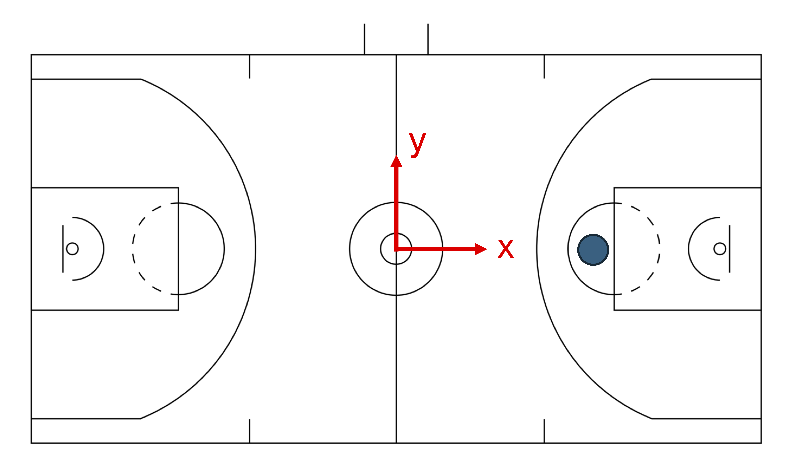
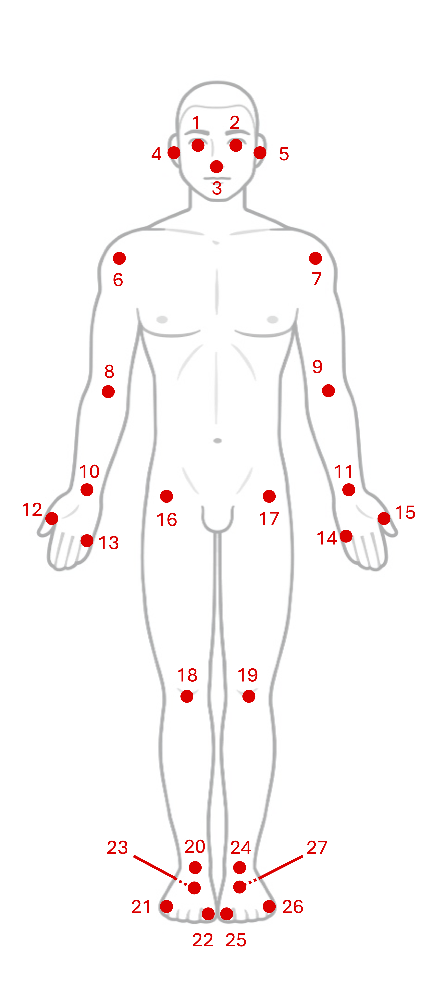
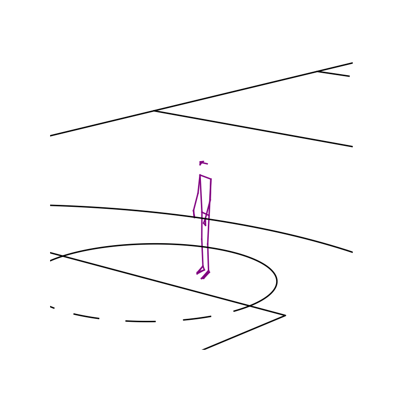

# SPL Free Throw Dataset Documentation

*Last updated: September 2024*

## File structure

The trials are in the `data/` folder in the current directory. They are organized as JSON files, with the naming convention `BB_FT_P0001_T000X.json`, where `X` refers to a trial ID. Trial IDs are simply increasing integers from `1` to the number of trials that the participant was a part of. We note here that trial IDs are in chronological order, and each participant's trials were taken in a single session, typically over the course of 2-3 hours. 

## Coordinate system and Units

For the pose keypoints and ball `xyz` positions, numbers are provided in **feet**, in accordance with the measurements provided in the NBA handbook. 

The coordinate system is placed on a basketball court with the origin at the center, as shown below:

<p align="center">
  
</p>

A few notes:
1. The `z` direction can be obtained using the right hand rule, pointing out of the screen in the above image. 
2. The blue circle shows the free throw line from which the shots in this dataset were taken. 

## Ball tracking
Ball tracking is provided through `x`, `y`, and `z` coordinates of the center of the ball, up until a few frames post release, when the ball was no longer in frame. 

**NOTE**: As the ball enters and leaves our capture volume (while ball is being passed to the shooter and post-release), the ball data might be noisy. The cameras in our motion capture system were optimized to focus on capturing the biomechanical movements of the shooter. 

Additionally, we provide two data points relating to the result of the free throw:
1. `x` and `y` coordinates of the ball landing on the hoop, measured with the front of the hoop as the origin, and the coordinate system shown in the figure below. These numbers are provided in **inches**. The point can be thought of as the location that the ball makes contact with the plane of the hoop.
2. The entry angle of the ball, again at the point when the ball breaks through the plane of the hoop. This number is measured in **degrees**. See the angle convention in the image below.

<center>  </center>
<center <figcaption> Hoop images taken from Dimensions.com  </figcaption> </center>

## Pose Markers 
The image below shows the person keypoints present in the dataset. The keypoint names in the table below the image are the keys in the dictionary.
<p align="center">
  
</p>

<center>

| Keypoint number | Keypoint name | Description
| :-: | :-: | :-: 
| 1 | R_EYE | Right eye 
| 2 | L_EYE | Left eye 
| 3 | NOSE | Nose
| 4 | R_EAR | Right ear
| 5 | L_EAR | Left ear
| 6 | R_SHOULDER | Right shoulder
| 7 | L_SHOULDER | Left shoulder 
| 8 | R_ELBOW | Right elbow
| 9 | L_ELBOW | Left elbow
| 10 | R_WRIST | Right wrist
| 11 | L_WRIST | Left wrist
| 12 | R_1STFINGER | Right thumb base joint
| 13 | R_5THFINGER | Right pinky base joint
| 14 | L_5THFINGER | Left pinky base joint
| 15 | L_1STFINGER | Left thumb base joint 
| 16 | R_HIP | Right hip 
| 17 | L_HIP | Left hip
| 18 | R_KNEE | Right knee
| 19 | L_KNEE | Left knee
| 20 | R_ANKLE | Right ankle
| 21 | R_5THTOE | Right small toe
| 22 | R_1STTOE | Right big toe
| 23 | R_CALC | Right calcaneus (heel)
| 24 | L_ANKLE | Left ankle
| 25 | L_1STTOE | Left big toe
| 26 | L_5THTOE | Left small toe 
| 27 | L_CALC | Left calcaneus (heel)

</center>

## Animation
We provide basic utilities to animate free throw trials. We use the 3D basketball court plotting functions from our [mplbasketball](https://github.com/mlsedigital/mplbasketball) plotting library. To be able to use this functionality, you will have to install it using 
```
pip install mplbasketball
```
The `animate_trial()` is defined in `utils/animate.py`, and produces a GIF like the one below:


