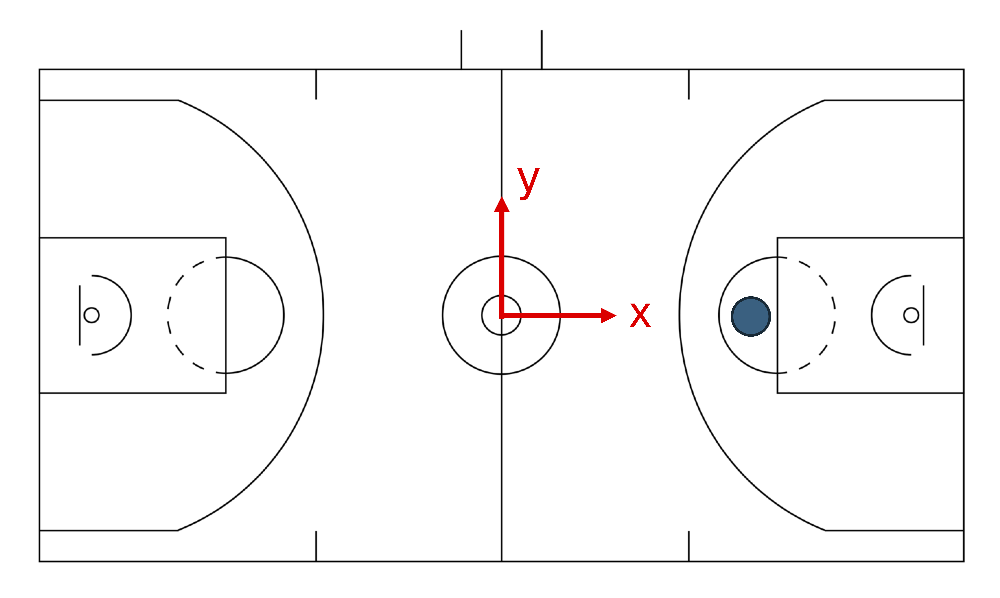

# SPL Free Throw Dataset Documentation

*Last updated: March 2026*

## File structure

The trials are in the `data/` folder in the current directory. They are organized as JSON files, with the naming convention `BB_FT_P0001_T000X.json`, where `X` refers to a trial ID. Trial IDs are simply increasing integers from `1` to the number of trials that the participant was a part of. We note here that trial IDs are in chronological order, and each participant's trials were taken in a single session, typically over the course of 2-3 hours. 

## Session Information

| Session | Participants | Trials (total)
| :-: | :-: | :-: |
| 2025-12-18 | 5 (P0001-P0005) | 458
| 2024-08-28 | 1 (P0001) | 125


## Coordinate system and Units

For the pose keypoints and ball `xyz` positions, numbers are provided in **feet**, in accordance with the measurements provided in the NBA handbook. 

The coordinate system is placed on a basketball court with the origin at the center, as shown below:

<p align="center">
  
</p>

A few notes:
1. The `z` direction can be obtained using the right hand rule, pointing out of the screen in the above image. 
2. The blue circle shows the free throw line from which the shots in this dataset were taken. 

## Ball tracking
Ball tracking is provided through `x`, `y`, and `z` coordinates of the center of the ball, up until a few frames post release, when the ball was no longer in frame. 

**NOTE**: As the ball enters and leaves our capture volume (while ball is being passed to the shooter and post-release), the ball data might be noisy. The cameras in our motion capture system were optimized to focus on capturing the biomechanical movements of the shooter. 

Additionally, we provide two data points relating to the result of the free throw:
1. `x` and `y` coordinates of the ball landing on the hoop, measured with the front of the hoop as the origin, and the coordinate system shown in the figure below. These numbers are provided in **inches**. The point can be thought of as the location that the ball makes contact with the plane of the hoop.
2. The entry angle of the ball, again at the point when the ball breaks through the plane of the hoop. This number is measured in **degrees**. See the angle convention in the image below.

<center>  </center>
<center <figcaption> Hoop images taken from Dimensions.com  </figcaption> </center>

## Pose Markers 
The table below shows the person keypoints present in the dataset. Not all sessions were run using the same pose model so there may be differences in availability of keypoints across sessions.

<center>

| Keypoint number | Keypoint name                  | Description                                      |
|-----------------|-------------------------------|--------------------------------------------------|
| 1               | NOSE                          | Nose                                             |
| 2               | LEFT_EYE                      | Left eye                                         |
| 3               | RIGHT_EYE                     | Right eye                                        |
| 4               | LEFT_EAR                      | Left ear                                         |
| 5               | RIGHT_EAR                     | Right ear                                        |
| 6               | NECK                          | Neck                                             |
| 7               | LEFT_SHOULDER                 | Left shoulder                                    |
| 8               | RIGHT_SHOULDER                | Right shoulder                                   |
| 9               | LEFT_ELBOW                    | Left elbow                                       |
| 10              | RIGHT_ELBOW                   | Right elbow                                      |
| 11              | LEFT_WRIST                    | Left wrist                                       |
| 12              | RIGHT_WRIST                   | Right wrist                                      |
| 13              | LEFT_THUMB                    | Left thumb base                                  |
| 14              | RIGHT_THUMB                   | Right thumb base                                 |
| 15              | LEFT_PINKY                    | Left pinky base                                  |
| 16              | RIGHT_PINKY                   | Right pinky base                                 |
| 17              | LEFT_FIRST_FINGER_CMC         | Left thumb carpometacarpal joint                 |
| 18              | LEFT_FIRST_FINGER_MCP         | Left thumb metacarpophalangeal joint             |
| 19              | LEFT_FIRST_FINGER_IP          | Left thumb interphalangeal joint                 |
| 20              | LEFT_FIRST_FINGER_DISTAL      | Left thumb tip                                   |
| 21              | LEFT_SECOND_FINGER_MCP        | Left index finger MCP joint                      |
| 22              | LEFT_SECOND_FINGER_PIP        | Left index finger PIP joint                      |
| 23              | LEFT_SECOND_FINGER_DIP        | Left index finger DIP joint                      |
| 24              | LEFT_SECOND_FINGER_DISTAL     | Left index finger tip                            |
| 25              | LEFT_THIRD_FINGER_MCP         | Left middle finger MCP joint                     |
| 26              | LEFT_THIRD_FINGER_PIP         | Left middle finger PIP joint                     |
| 27              | LEFT_THIRD_FINGER_DIP         | Left middle finger DIP joint                     |
| 28              | LEFT_THIRD_FINGER_DISTAL      | Left middle finger tip                           |
| 29              | LEFT_FOURTH_FINGER_MCP        | Left ring finger MCP joint                       |
| 30              | LEFT_FOURTH_FINGER_PIP        | Left ring finger PIP joint                       |
| 31              | LEFT_FOURTH_FINGER_DIP        | Left ring finger DIP joint                       |
| 32              | LEFT_FOURTH_FINGER_DISTAL     | Left ring finger tip                             |
| 33              | LEFT_FIFTH_FINGER_MCP         | Left pinky finger MCP joint                      |
| 34              | LEFT_FIFTH_FINGER_PIP         | Left pinky finger PIP joint                      |
| 35              | LEFT_FIFTH_FINGER_DIP         | Left pinky finger DIP joint                      |
| 36              | LEFT_FIFTH_FINGER_DISTAL      | Left pinky finger tip                            |
| 37              | RIGHT_FIRST_FINGER_CMC        | Right thumb carpometacarpal joint                |
| 38              | RIGHT_FIRST_FINGER_MCP        | Right thumb metacarpophalangeal joint            |
| 39              | RIGHT_FIRST_FINGER_IP         | Right thumb interphalangeal joint                |
| 40              | RIGHT_FIRST_FINGER_DISTAL     | Right thumb tip                                  |
| 41              | RIGHT_SECOND_FINGER_MCP       | Right index finger MCP joint                     |
| 42              | RIGHT_SECOND_FINGER_PIP       | Right index finger PIP joint                     |
| 43              | RIGHT_SECOND_FINGER_DIP       | Right index finger DIP joint                     |
| 44              | RIGHT_SECOND_FINGER_DISTAL    | Right index finger tip                           |
| 45              | RIGHT_THIRD_FINGER_MCP        | Right middle finger MCP joint                    |
| 46              | RIGHT_THIRD_FINGER_PIP        | Right middle finger PIP joint                    |
| 47              | RIGHT_THIRD_FINGER_DIP        | Right middle finger DIP joint                    |
| 48              | RIGHT_THIRD_FINGER_DISTAL     | Right middle finger tip                          |
| 49              | RIGHT_FOURTH_FINGER_MCP       | Right ring finger MCP joint                      |
| 50              | RIGHT_FOURTH_FINGER_PIP       | Right ring finger PIP joint                      |
| 51              | RIGHT_FOURTH_FINGER_DIP       | Right ring finger DIP joint                      |
| 52              | RIGHT_FOURTH_FINGER_DISTAL    | Right ring finger tip                            |
| 53              | RIGHT_FIFTH_FINGER_MCP        | Right pinky finger MCP joint                     |
| 54              | RIGHT_FIFTH_FINGER_PIP        | Right pinky finger PIP joint                     |
| 55              | RIGHT_FIFTH_FINGER_DIP        | Right pinky finger DIP joint                     |
| 56              | RIGHT_FIFTH_FINGER_DISTAL     | Right pinky finger tip                           |
| 57              | MID_HIP                       | Mid hip (center)                                 |
| 58              | LEFT_HIP                      | Left hip                                         |
| 59              | RIGHT_HIP                     | Right hip                                        |
| 60              | LEFT_KNEE                     | Left knee                                        |
| 61              | RIGHT_KNEE                    | Right knee                                       |
| 62              | LEFT_ANKLE                    | Left ankle                                       |
| 63              | RIGHT_ANKLE                   | Right ankle                                      |
| 64              | LEFT_BIG_TOE                  | Left big toe                                     |
| 65              | LEFT_SMALL_TOE                | Left small toe                                   |
| 66              | LEFT_HEEL                     | Left heel (calcaneus)                            |
| 67              | RIGHT_BIG_TOE                 | Right big toe                                    |
| 68              | RIGHT_SMALL_TOE               | Right small toe                                  |
| 69              | RIGHT_HEEL                    | Right heel (calcaneus)                           |

</center>

## Animation
We provide basic utilities to animate free throw trials. We use the 3D basketball court plotting functions from our [mplbasketball](https://github.com/mlsedigital/mplbasketball) plotting library. To be able to use this functionality, you will have to install it using 
```
pip install mplbasketball
```
The `animate_trial()` is defined in `utils/animate.py`, and produces a GIF like the one below:


